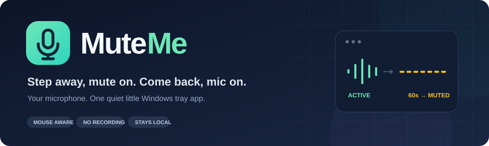

<p align="center">
  
</p>

<p align="center">
  <strong>A little tray app that remembers to mute when you step away.</strong><br>
  No mouse activity for one minute? Your microphone goes quiet.<br>
  Move the mouse again, and MuteMe restores it.
</p>

<p align="center">
  
  
  
  
</p>

<p align="center">
  <a href="#get-started">Get started</a> ·
  <a href="#make-it-yours">Settings</a> ·
  <a href="#small-by-design">Performance</a> ·
  <a href="#build-from-source">Build</a> ·
  <a href="#questions">FAQ</a>
</p>

---

## Why MuteMe?

You get up from your desk. Your mic stays live. MuteMe handles that small, easy-to-forget step for you, using mouse inactivity as the cue.

| Feature | What you get |
| --- | --- |
| 🎙️ Automatic mute | Mutes the selected microphone after **60 seconds** without mouse activity. |
| 🖱️ Quick return | Movement, clicking, or scrolling restores a mute made by MuteMe, normally within **250 ms**. |
| 🤫 Your mute stays yours | If your microphone was already muted, MuteMe leaves it muted when you return. |
| 🎛️ Pick your microphone | Choose a Windows input device or follow the Windows default input. |
| 🔔 Quiet notifications | Small Windows notifications, with an option to turn them off. |
| 🪶 Tray-only app | No permanent window, browser engine, or background audio processing. |
| 🔒 Local operation | No audio recording, camera access, telemetry, or network requests. |

> **Presence is inferred from your mouse.** Keyboard activity does not reset the timer. Pause MuteMe when reading, watching a video, or speaking without using the mouse.

## Get started

**Requirements:** 64-bit Windows 10 or 11, the Windows .NET Framework 4.x runtime, and a microphone with a Windows endpoint mute control.

1. Get `MuteMe.exe` from a release, if one is available, or [build it from source](#build-from-source).
2. Place it in a folder you want to keep and double-click it. No installer or administrator access is needed.
3. Find the microphone icon beside the Windows clock. It may be inside the **^** hidden-icons area.
4. Right-click → **Microphone** and choose your input device.
5. Leave the mouse untouched for one minute. Move it again to restore your mic.

On first launch, MuteMe selects the only available microphone, or the only input whose name contains “USB.” If the choice is ambiguous, it starts paused so you can choose. Selecting a microphone starts monitoring.

## Make it yours

Everything lives in the tray menu:

| Setting | Behavior |
| --- | --- |
| **Pause automatic muting** | Restores a mute made by MuteMe and pauses automatic muting. Click again to resume. |
| **Microphone** | Select a particular input or **Follow Windows default input**. |
| **Mute after** | Choose **1, 2, or 5 minutes**. Default: 1 minute. |
| **Small notifications** | Turn mute and restore notifications on or off. |
| **Start with Windows** | Optional automatic launch at sign-in. Off by default. |
| **Exit (restore microphone)** | Restores a mute made by MuteMe and closes the app. |

**🟢 Green:** monitoring &nbsp; **🟠 Orange:** idle &nbsp; **⚪ Gray:** paused or microphone unavailable.

Windows controls notification placement and duration. Do Not Disturb can suppress them.

## Small by design

MuteMe uses Windows Forms, Windows Raw Input, and the Core Audio endpoint API. It listens for mouse events and checks the inactivity timer four times per second. It does not process an audio stream.

- No third-party runtime packages or downloads at launch.
- One selected microphone at a time; speaker sound and volume levels are untouched.
- Device enumeration happens when opening the tray menu. While idle, the app checks its target every five seconds.
- Settings stay on your computer in `%LOCALAPPDATA%\MuteMe`.

For reference, the original implementation measured approximately **34 MB working-set RAM** during a brief startup smoke test on one Windows PC. This is a sample measurement, not a guaranteed memory ceiling; usage varies with Windows and the runtime.

## Build from source

The build uses the C# compiler installed with the 64-bit Windows .NET Framework. No NuGet restore is needed.

From PowerShell in the repository folder:

```powershell
powershell -ExecutionPolicy Bypass -File .\build.ps1 -Test
```

The executable is written to **`dist\MuteMe.exe`**. The `-Test` option runs the mute-state and inactivity tests without changing your real microphone.

```text
MuteMe/
├── assets/             README artwork and application icon
├── docs/               Publishing instructions
├── src/
│   ├── MuteMe.cs       Tray app, mouse input, settings, and policy tests
│   ├── Audio.cs        Windows Core Audio interop
│   └── AssemblyInfo.cs Application metadata
├── build.ps1           Build, with optional self-tests
└── README.md
```

### Development checks

```powershell
# Unit checks: idle threshold, restore, existing mute, failure recovery
Start-Process .\dist\MuteMe.exe -ArgumentList '--self-test', "`"$PWD\dist\test-results.txt`"" -Wait
Get-Content .\dist\test-results.txt

# Read-only microphone detection and mute-state diagnostics
Start-Process .\dist\MuteMe.exe -ArgumentList '--diagnostics', "`"$PWD\dist\audio-diagnostics.txt`"" -Wait

# Tray startup, mouse-input registration, menu creation, and clean exit
# Exits after five seconds; does not change audio or saved settings
Start-Process .\dist\MuteMe.exe -ArgumentList '--smoke-test' -Wait
```

These checks verify policy logic and startup. They do not prove hardware mute behavior on every microphone. Test your chosen microphone before relying on it.

## Questions

**Is this only for the HyperX SoloCast?**

No. MuteMe targets Windows audio input devices, including USB, built-in, headset, and audio-interface microphones that expose endpoint mute control. Hardware and applications using unusual or exclusive audio paths may behave differently.

**Does it mute my speakers too?**

No. It controls one selected microphone and leaves playback audio alone.

**Does it know when I physically leave the room?**

It uses mouse inactivity. It does not use a webcam or listen to your voice.

**Will it undo my manual mute?**

It preserves a mute that was already set when the idle period began. Once MuteMe has muted the mic, your return restores that app-made mute; it cannot distinguish a second manual mute applied during that same period.

**What happens if I unplug my microphone?**

An explicitly selected microphone remains the target. MuteMe retries while idle rather than choosing another microphone. If Windows cannot restore an app-made mute after disconnection, reconnect the device or restore it in Windows sound settings.

**Can I hide the tray icon?**

Drag it into Windows’ hidden-icons area to keep it running. Use **Exit (restore microphone)** to close it completely.

**How do I uninstall it?**

Turn off **Start with Windows**, exit MuteMe, and delete its folder. Optionally delete `%LOCALAPPDATA%\MuteMe` as well.

**What if I force-close it?**

Windows may retain the mute after a crash or forced termination. Restore the microphone in Windows sound settings. Normal Exit restores a mute made by the app.

**I used the earlier MouseMic version. How do I switch?**

Turn off **Start with Windows** in MouseMic and exit it before launching MuteMe. The renamed app uses its own settings folder and startup entry, so choose your preferences again.

## Publish on GitHub

Source files and artwork belong in Git. Generated executables are ignored; attach `MuteMe.exe` or a ZIP to a GitHub release for people who just want to use it.

See the [publishing guide](docs/PUBLISHING.md) for commands for a new or existing repository.

---

<p align="center"><strong>Step away. Go quiet. Come back. Be heard.</strong></p>
